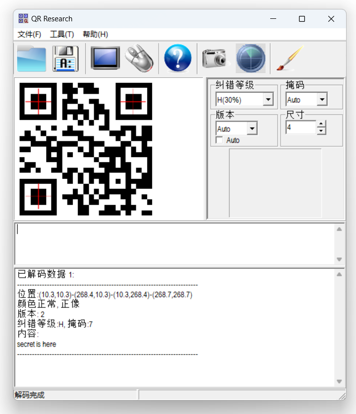
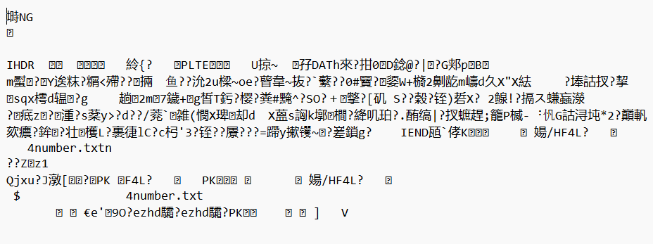
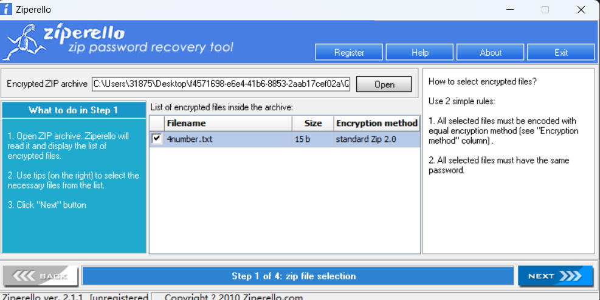
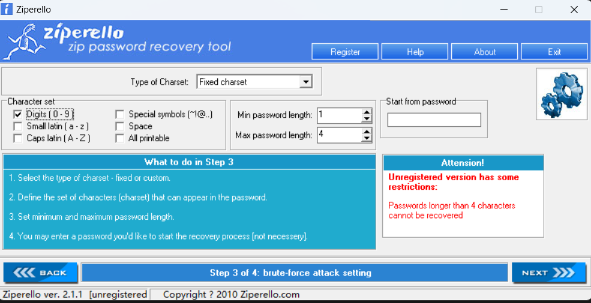
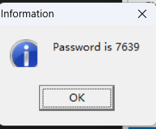

# 二维码
二维码, 现在很常见, 1994年在日本发明的

给你一张二维码, 这张二维码背后隐藏什么信息呢?

然后 用【QR Research】工具扫一下二维码:

只看见秘密在这里，那么秘密在哪里呢？

那我们把图片的后缀改成txt看看有没有啥隐藏信息

看到了, 隐藏的数据中有一个txt的呢, 同时还有PK

PK是zip发明人的姓名缩写, 不过PK是个悲情天才。。。

那我们把文件名后缀改成zip吧

接下来我们使用【ziprello】来暴力破解zip密码

